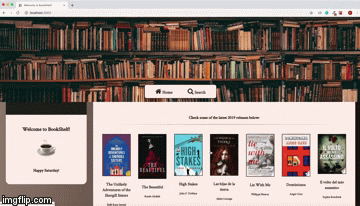

# BookShelf app

BookShelf is an app designed to search books from the Google Books API. The homepage showcases the latest book releases, and users can search for books by entering relevant keywords in the provided input field.

This app has been developed using React JS, React Hooks, and React Router. Its design is based on the use of CSS Grid Layout and Flexbox, making all pages of the app mobile-responsive.

Demo gif:

